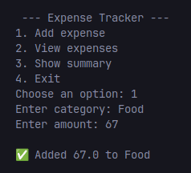
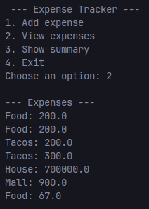
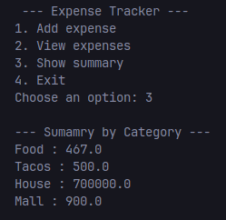

A simple command-line Expense Tracker built in Python.
It allows you to add expenses, view all expenses, and see a summary by category -- with data saved persistently in a JSON file

Features
    - Add expenses with category ammount
    - View all saved expenses
    - Persistent storage using JSON
    - Summary fo expenses by category
    - Clean architecture

Project Structure
    expense-tracker/
    ├── model.py         # Data logic (JSON read/write, calculations)
    ├── view.py          # User interface (CLI input/output)
    ├── presenter.py     # Program flow (connects Model & View)
    ├── requirements.txt # Dependencies (minimal)
    ├── data.json        # Expense storage (auto-generated)
    └── README.md        # Project description

Getting Started
1.- Clone The repo
    git clone https://github.com/aAzulis/Expense-Tracker.git
    cd Expense-Tracker

2.- Create a virtual enviroment
    python -m venv .venv
    source .venv/bin/activate   # Linux/Mac
    .venv\Scripts\activate      # Windows

3.- Install Dependencies
    pip install -r requirements.txt

4.- Run the program
    python presenter.py

Example Usage

MVP Breakdown
Model -> Handles expense storage and calculations
View -> Handles input/output with the user
Presenter -> Core logig connecting Model and View

📌 Future Improvements
    - Add timestamps for expenses
    - Generate charts
    - Flter/search expenses by category or date
    - Add unit tests for reliability

License
This project is open-source under the MIT License